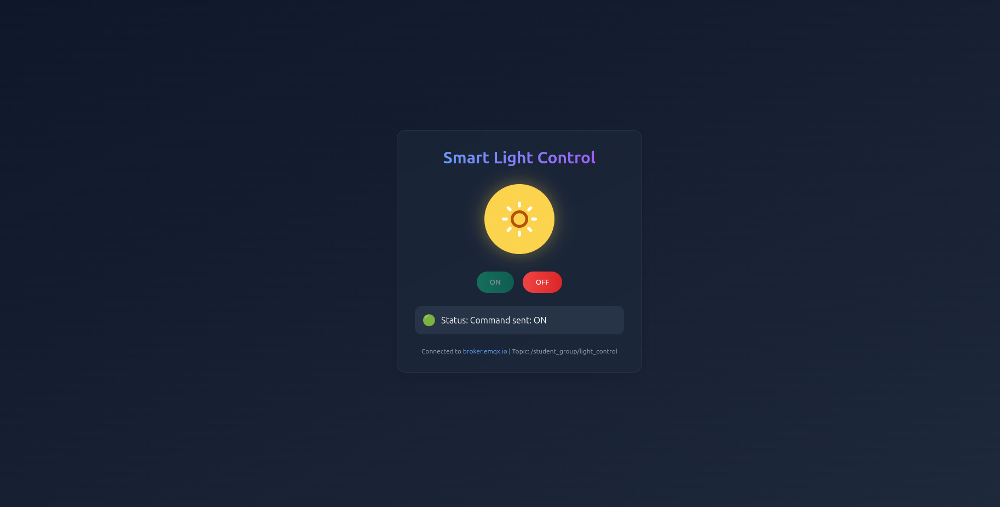

# Modern MQTT Light Control System

This project implements an elegant MQTT-based light control system with a modern web interface and a simulated IoT device.

## Features

- **Modern UI**: Sleek glass-morphism design with smooth animations
- **Real-time Control**: Instantly control your smart light via MQTT
- **Status Indicators**: Visual feedback for connection and command status
- **Responsive Design**: Works on desktop and mobile devices
- **Light Visualization**: Interactive light bulb with ON/OFF state visualization

## Components

1. **Web Interface** (`index.html`): A modern, responsive webpage with an interactive light control UI
2. **IoT Device Simulator** (`smart_light.py`): A Python script that simulates an IoT device

## Screenshots


*MQTT Broker Information*

## Prerequisites

- Python 3.x
- Modern web browser (Chrome, Firefox, Safari, Edge)
- Internet connection

## Python Dependencies

Install the required Python package:
```bash
pip install paho-mqtt
